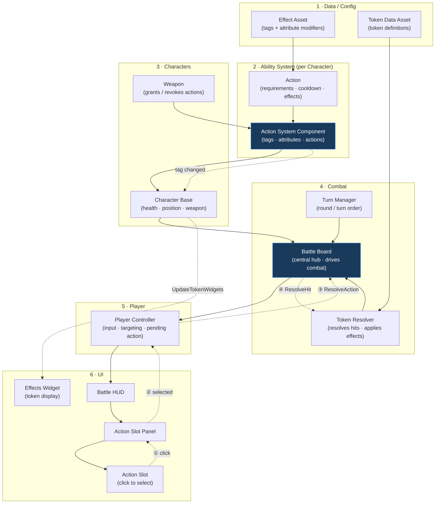

# Architecture
Sample code can be found under the code samples folder.
- [WanderersTokenResolver.h](code_samples/WanderersTokenResolver.h)
- [WanderersBattleBoard.h](code_samples/WanderersBattleBoard.h)
- [WanderersActionSystemComponent.h](code_samples/WanderersActionSystemComponent.h)

